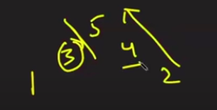

1. [Set matrix Zero](https://leetcode.com/problems/set-matrix-zeroes/)

   - check 1st row and column if they are going to be all zero
   - Except 1st row and column check the matrix and search for the zero
   - if a cell is zero assign the first row cell and column cell as zero and then process it in another loop accordingly

2. [Pascal Triangle](https://leetcode.com/problems/pascals-triangle/submissions/)

3. [Next permutaion](https://leetcode.com/problems/next-permutation/submissions/)

   - Find the breakpoint of increasing sequence
   - Again traverse from the back and find the first element greater than the breakpoint el.
   - swap them and reverse all the elements after the breakpoint index because from the back it will be linearly increasing
   - 

4. [Max subarray](https://leetcode.com/problems/maximum-subarray/)

   - sum = max(sum+nums[i],nums[i])
   - lsum = max(lsum,sum)

5. [Sort colors](https://leetcode.com/problems/sort-colors/submissions/)

   - Count # 0s,1s and 2s and then overwrite them into the array

6. [Best time to buy and Sell Stocks](https://leetcode.com/problems/best-time-to-buy-and-sell-stock/submissions/)

7. [Rotate Matrix](https://leetcode.com/problems/rotate-image/)

   - Transpose the matrix and reverse each row

8. [Merged Intervals](https://leetcode.com/problems/merge-intervals/submissions/)

   - Sort the array on the basis of the first element
   - check if the interval's start date is less than or equal to the previous interval's end date
   - if it is, then make and interval of (s,max(currEnd,prevEnd))

9. [Merge Sorted Array](https://leetcode.com/problems/merge-sorted-array/submissions/)

   - Start filling the num1 array from the end
   - initialize i = m-1 and j = n-1, k = m-n-1
   - compare the last el of both arrays and then put the greatest one in the kth position and then decrement k
   - if(nums1[i] < nums2[j])
     {
     nums1[k] = nums2[j];
     k--;
     j--;
     }
     else
     {
     nums1[k] = nums1[i];
     k--;
     i--;

     }

10. [Find Duplicate Number](https://leetcode.com/problems/find-the-duplicate-number/submissions/)

    - Put the elements to nums[nums[i]-1] positions
    - If nums[nums[i]-1] == nums[i] then this is the repeating number
    - if not equal then swap those elements and continue the algo without incrementing the index(i)

11. [Largest subarray with sum 0](https://practice.geeksforgeeks.org/problems/largest-subarray-with-0-sum/1#)

    - First let us initialise a variable say sum = 0 which stores the sum of elements traversed so far and another variable say max = 0 which stores the length of longest subarray with sum zero.
    - Declare a HashMap<Integer, Integer> which stores the prefix sum of every element as key and its index as value.
    - Now traverse the array, and add the array element to our sum.
      (i) If sum = 0, then we can say that the subarray until the current index has a sum = 0, so we update max with the maximum value of (max, current_index+1)

12. [Range sum query](https://leetcode.com/problems/range-sum-query-2d-immutable/)

    - https://leetcode.com/problems/range-sum-query-2d-immutable/discuss/2104317/DP-Visualised-%2B-Interview-Tipss

13. [Longest substring without repeating characters](https://leetcode.com/problems/longest-substring-without-repeating-characters/)

    - Maintaining freq map and checking if size of map is equal to the length of the window or not.
    - if yes then increament the end pointer.
    - if no then erase the st[s] char and increament the start pointer.

14. [first missing positive number](https://leetcode.com/problems/first-missing-positive/submissions/)

    - Swap nums[i] with nums[nums[i]-1] so that all the 1st index has 1 2nd index has 2 ans so on...
    - after that iterate over the nums vector and check if (nums[i]!=i+1) then return i+1 because it is the first positive integer which is no present

15. [Non decreasing Array](https://leetcode.com/problems/non-decreasing-array/submissions/)

    - If we found a pair where nums[i-1] > nums[i], we can perform one of two operations,
    - Changes nums[i-1] to nums[i], when nums[i-2] <= nums[i] .
    - Changes nums[i] to nums[i-1], when the above case is not true.

16. [Longest consecutive sequence](https://leetcode.com/problems/longest-consecutive-sequence/)
